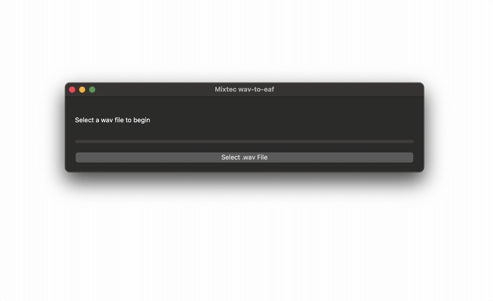

# u2u-asr-pyqt

Experimental PyQt interface for packaging and deploying an ASR model on a user's computer using:

- [pedalboard](https://github.com/spotify/pedalboard) for dependency-free audio file opening and resampling (i.e. no need for ffmpeg, etc.)
- [silero](https://github.com/snakers4/silero-vad) for voice activity detection
- [mHuBERT-147](https://huggingface.co/utter-project/mHuBERT-147) fine-tuned for ASR (exported to ONNX, to remove torch/torchaudio dependency)
- PyQt5 for user interface PyInstaller for packaging models and interface into a single executable



## Setup

### macOS/Linux

```bash
python -m venv packenv
source packenv/bin/activate
pip3 install PyQt5 PyInstaller pedalboard onnxruntime pympi-ling
rm -rf __pycache__

packenv/bin/pyinstaller \
	--windowed \
	--onedir \
	--add-data="assets/silero_vad.onnx:assets" \
	--add-data="assets/mhubert_asr.onnx:assets" \
	app.py
```

### Windows

Unlike macOS/Linux, the build process for Windows turned out to be extremely finicky with version requirements (combination below seems to be working as of July 4, 2025).

```
conda install -n packenv python=3.10
conda activate packenv
pip3 install PyQt5 PyInstaller pedalboard==0.9.6 numpy==1.26.4 onnxruntime==1.14.0 pympi-ling

PyInstaller ^
	--windowed ^
	--onedir ^
	--add-data="assets/silero_vad.onnx:assets" ^
	--add-data="assets/mhubert_asr.onnx:assets" ^
	app.py
```
